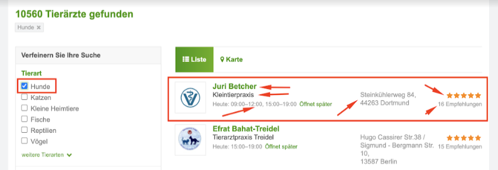

# Scraping web-site "Zooplus"

My task was "Collect in csv the data from the first 5 pages(100 records)."




## Installing / Getting started

Python3 must be already installed!

```shell
git clone git@github.com:anastasia-martyniuk/scraping_zooplus.git
python -m venv venv
source venv/Scripts/activate(Windows OS) == source venv/bin/activate(MAC OS)
pip install -r requirements.txt
python main.py
```

After finishing "python main.py" you will see a file "doctors.csv" with all the necessary data.
